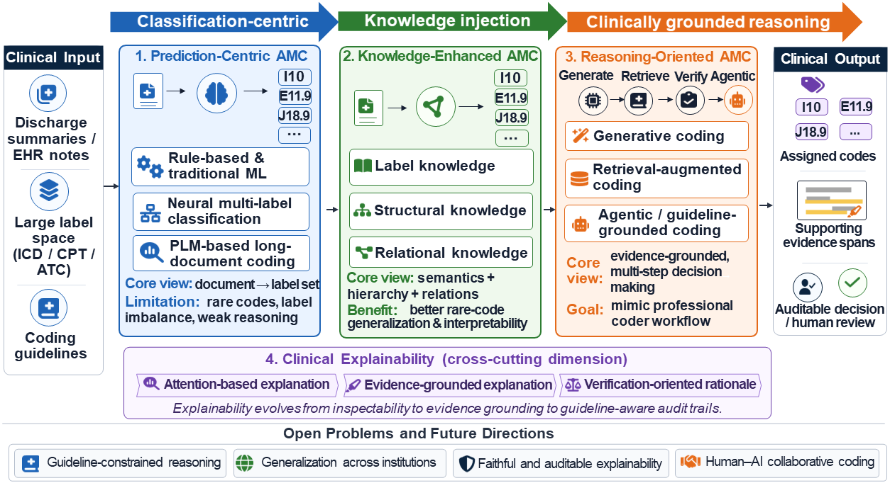

# Automated Medical Coding in the Era of LLMs

A curated paper list for the survey **Automated Medical Coding in the Era of LLMs: From Multi-label Classification to Clinically Grounded Reasoning**.

This repository organizes papers, datasets, benchmarks, and resources related to Automated Medical Coding (AMC), with a focus on the transition from prediction-centric classification to knowledge-enhanced and LLM-based clinical reasoning.

## Overview
Automated Medical Coding (AMC) aims to assign standardized clinical codes, such as ICD codes, to patient health records. These codes are essential for healthcare billing, insurance reimbursement, epidemiological surveillance, hospital quality reporting, and clinical research.

This repository accompanies the survey **Automated Medical Coding in the Era of LLMs: From Multi-label Classification to Clinically Grounded Reasoning**. The survey reviews the evolution of AMC from traditional rule-based and neural multi-label classification methods to knowledge-enhanced, retrieval-augmented, and LLM-based reasoning systems.

We organize the literature into three main paradigms:

1. **Prediction-Centric Coding**, which formulates AMC as an extreme multi-label classification problem.
2. **Knowledge-Enhanced Coding**, which incorporates code semantics, ICD hierarchy, medical ontologies, and code relations.
3. **Reasoning-Oriented Coding**, which reframes AMC as retrieval, verification, and agentic clinical reasoning.

We also treat **Explainable Coding** as a cross-cutting dimension, tracing its development from attention-based interpretation to evidence-grounded and verification-oriented rationales.

This repository provides categorized papers, datasets, benchmarks, evaluation metrics, and related resources for researchers interested in AMC, clinical NLP, medical coding, and LLM-based clinical reasoning.

  

  <em>Overview of our survey: from prediction-centric coding to knowledge-enhanced coding and reasoning-oriented coding, with explainability as a cross-cutting dimension.</em>

## Table of Contents

- [Overview](#overview)
- [Taxonomy](#taxonomy)
- [Related Surveys, Benchmarks and Position Papers](#related-surveys-benchmarks-and-position-papers)
- [Paper List](#paper-list)
  - [Prediction-Centric Coding](#prediction-centric-coding)
  - [Knowledge-Enhanced Coding](#knowledge-enhanced-coding)
  - [Reasoning-Oriented Coding](#reasoning-oriented-coding)
  - [Explainable Coding](#explainable-coding)
  - [Datasets and Evaluation](#datasets-and-evaluation)
- [Datasets and Benchmarks](#datasets-and-benchmarks)
  - [Standard Code-Prediction Benchmarks](#standard-code-prediction-benchmarks)
  - [Evidence-Annotated Benchmarks](#evidence-annotated-benchmarks)
  - [Multilingual and Non-English Benchmarks](#multilingual-and-non-english-benchmarks)
- [Resources](#resources)
- [Citation](#citation)

## Taxonomy

This survey organizes Automated Medical Coding (AMC) research into three major paradigms, reflecting the evolution of the field from label prediction to clinically grounded reasoning.

### Prediction-Centric Coding

Prediction-centric methods formulate AMC as an extreme multi-label classification problem. Given a clinical document, the model predicts a set of applicable medical codes from a large code vocabulary. This paradigm includes rule-based systems, traditional machine learning methods, CNN/RNN-based neural models, label-wise attention models, and pretrained language model approaches.

### Knowledge-Enhanced Coding

Knowledge-enhanced methods recognize that medical codes are not ordinary labels. ICD codes contain semantic descriptions, hierarchical structures, and clinical relations. This paradigm incorporates external knowledge such as code descriptions, synonyms, medical ontologies, ICD hierarchies, code co-occurrence patterns, and cross-system mappings to improve rare-code prediction, semantic alignment, and interpretability.

### Reasoning-Oriented Coding

Reasoning-oriented methods reframe AMC as a process of retrieval, verification, and clinical reasoning rather than direct label prediction. This paradigm includes LLM-based coding, retrieval-augmented coding, code verification, and agentic coding systems that imitate professional coding workflows by identifying evidence, retrieving candidate codes, checking guidelines, and producing evidence-grounded decisions.

### Explainable Coding

Explainable coding is treated as a cross-cutting dimension across all paradigms. Early systems mainly used attention-based explanations to highlight code-relevant text. More recent systems move toward evidence-grounded explanations and verification-oriented rationales, where each assigned code is supported by explicit textual evidence, coding rules, and auditable reasoning traces.

| Paradigm | Main Focus | Representative Directions |
| -------- | ---------- | ------------------------- |
| Prediction-Centric Coding | Code prediction as multi-label classification | Rule-based systems, CNN/RNN models, label attention, PLMs |
| Knowledge-Enhanced Coding | Injecting medical and code-system knowledge | Code semantics, ICD hierarchy, UMLS, code relations |
| Reasoning-Oriented Coding | Coding as retrieval, verification, and reasoning | LLM coding, RAG, verification, agentic workflows |
| Explainable Coding | Making code assignments auditable | Attention, evidence spans, verification rationales |

## Related Surveys, Benchmarks and Position Papers

Automated Medical Coding (AMC) has been reviewed from several complementary perspectives. Early and general surveys summarize the development of automated ICD coding from rule-based systems and traditional machine learning to neural-network-based approaches, while also discussing common challenges such as large label spaces, imbalanced code distributions, long clinical documents, and interpretability. Other reviews focus on deep learning-based ICD coding, systematic literature analysis, benchmark construction, and reproducibility.

Compared with prior surveys, our survey focuses on the LLM era of automated medical coding. Rather than organizing the literature only by model architecture, we emphasize the conceptual transition from prediction-centric multi-label classification to knowledge-enhanced coding and reasoning-oriented coding. We also treat explainability as a central cross-cutting requirement, tracing its evolution from attention-based interpretation to evidence-grounded and verification-oriented rationales.

| Year | Venue | Title | Focus |
| ---- | ----- | ----- | ----- |
| 2025 | Artificial Intelligence in Medicine | [Deep learning for automatic ICD coding: Review, opportunities and challenges](https://doi.org/10.1016/j.artmed.2025.103187) | Deep learning review and future directions |
| 2025 | ACL | [Aligning AI Research with the Needs of Clinical Coding Workflows: Eight Recommendations Based on US Data Analysis and Critical Review](https://aclanthology.org/2025.acl-long.45.pdf) | Clinical workflow-oriented review |
| 2024 | ACM Computing Surveys | [A Unified Review of Deep Learning for Automated Medical Coding](https://arxiv.org/abs/2201.02797) | Unified deep learning framework |
| 2023 | TKDE | [A Review on Deep Neural Networks for ICD Coding](https://doi.org/10.1109/TKDE.2022.3148267) | Deep neural network methods |
| 2023 | Expert Systems with Applications | [AI-based ICD coding and classification approaches using discharge summaries: A systematic literature review](https://doi.org/10.1016/j.eswa.2022.118997) | Systematic review of discharge-summary coding |
| 2023 | SIGIR | [Automated Medical Coding on MIMIC-III and MIMIC-IV: A Critical Review and Replicability Study](https://arxiv.org/abs/2304.10909) | Replicability and benchmark evaluation |
| 2022 | Intelligent Medicine | [A survey of automated International Classification of Diseases coding: development, challenges, and applications](https://doi.org/10.1016/j.imed.2022.03.003) | General ICD coding survey |
| 2022 | EMNLP Demo | [AnEMIC: A Framework for Benchmarking ICD Coding Models](https://aclanthology.org/2022.emnlp-demos.11.pdf) | Benchmarking framework |

## Paper List

### Prediction-Centric Coding

| Year | Venue | Title |
| ---- | ----- | ----- |
| 2026 | NLDM | [LTR-ICD: A Learning-to-Rank Approach for Automatic ICD Coding](https://arxiv.org/abs/2510.13922) |
| 2025 | CCL | [ClinSplitFT: Enhancing ICD Coding in Chinese EMRs with Prompt Engineering and Candidate Set Splitting](https://aclanthology.org/2025.ccl-2.39.pdf) |
| 2024 | NAACL Findings | [Applications of BERT Models Towards Automation of Clinical Coding in Icelandic](https://aclanthology.org/2024.findings-naacl.127.pdf) |
| 2024 | BioNLP | [Low-resource ICD Coding of Hospital Discharge Summaries](https://aclanthology.org/2024.bionlp-1.45.pdf) |
| 2023 | NeurIPS | [Towards Semi-Structured Automatic ICD Coding via Tree-based Contrastive Learning](https://arxiv.org/abs/2310.09672) |
| 2023 | ACL Findings | [A Two-Stage Decoder for Efficient ICD Coding](https://aclanthology.org/2023.findings-acl.285/) |
| 2022 | ClinicalNLP | [PLM-ICD: Automatic ICD Coding with Pretrained Language Models](https://aclanthology.org/2022.clinicalnlp-1.2/) |
| 2022 | Louhi | [BERT for Long Documents: A Case Study of Automated ICD Coding](https://aclanthology.org/2022.louhi-1.12) |
| 2022 | ICNLSP | [Semi-supervised Automated Clinical Coding Using International Classification of Diseases](https://aclanthology.org/2022.icnlsp-1.11.pdf) |
| 2022 | COLING | [Automatic ICD Coding Exploiting Discourse Structure and Reconciled Code Embeddings](https://aclanthology.org/2022.coling-1.254/) |
| 2022 | DASFAA | [HieNet: Bidirectional Hierarchy Framework for Automated ICD Coding](https://arxiv.org/abs/2212.04891) |
| 2022 | COLING | [TreeMAN: Tree-enhanced Multimodal Attention Network for ICD Coding](https://arxiv.org/abs/2305.18576) |
| 2022 | arXiv | [An Automatic ICD Coding Network Using Partition-Based Label Attention](https://arxiv.org/abs/2211.08429) |
| 2022 | NAACL | [Medical Coding with Biomedical Transformer Ensembles and Zero/Few-shot Learning](https://arxiv.org/abs/2206.02662) |
| 2022 | ICANN | [Improving Predictions of Tail-end Labels Using Concatenated BioMed-Transformers for Long Medical Documents](https://arxiv.org/abs/2112.01718) |
| 2021 | BioNLP | [Towards BERT-based Automatic ICD Coding: Limitations and Opportunities](https://aclanthology.org/2021.bionlp-1.6/) |
| 2021 | ACL-IJCNLP Findings | [Fusion: Towards Automated ICD Coding via Feature Compression](https://aclanthology.org/2021.findings-acl.184.pdf) |
| 2021 | ACL-IJCNLP Findings | [Medical Code Assignment with Gated Convolution and Note-Code Interaction](https://aclanthology.org/2021.findings-acl.89v1.pdf) |
| 2021 | arXiv | [From Extreme Multi-label to Multi-class: A Hierarchical Approach for Automated ICD-10 Coding Using Phrase-level Attention](https://arxiv.org/abs/2102.09136) |
| 2021 | MLHC | [Read, Attend, and Code: Pushing the Limits of Medical Codes Prediction from Clinical Notes by Machines](https://arxiv.org/abs/2107.10650) |
| 2021 | Computers in Biology and Medicine | [Does the Magic of BERT Apply to Medical Code Assignment? A Quantitative Study](https://arxiv.org/abs/2103.06511) |
| 2020 | ClinicalNLP | [BERT-XML: Large Scale Automated ICD Coding Using BERT Pretraining](https://aclanthology.org/2020.clinicalnlp-1.3/) |
| 2020 | AAAI | [ICD Coding from Clinical Text Using Multi-Filter Residual Convolutional Neural Network](https://arxiv.org/abs/1912.00862) |
| 2020 | IJCAI | [A Label Attention Model for ICD Coding from Clinical Text](https://arxiv.org/abs/2007.06351) |
| 2019 | Computer Methods and Programs in Biomedicine | [An Empirical Evaluation of Deep Learning for ICD-9 Code Assignment Using MIMIC-III Clinical Notes](https://arxiv.org/abs/1802.02311) |
| 2018 | ACL | [A Neural Architecture for Automated ICD Coding](https://aclanthology.org/P18-1098/) |
| 2018 | NAACL | [Explainable Prediction of Medical Codes from Clinical Text](https://aclanthology.org/N18-1100.pdf) |
| 2017 | arXiv | [Towards Automated ICD Coding Using Deep Learning](https://arxiv.org/abs/1711.04075) |
| 2014 | BioNLP | [A System for Predicting ICD-10-PCS Codes from Electronic Health Records](https://aclanthology.org/W14-3409.pdf) |
| 2011 | BioNLP | [Automatic Matching of ICD-10 Codes to Diagnoses in Discharge Letters](https://aclanthology.org/W11-4203/) |
| 2010 | Louhi | [Machine Learning and Features Selection for Semi-Automatic ICD-9-CM Encoding](https://aclanthology.org/W10-1113/) |
| 2008 | BMC Bioinformatics | [Automatic Construction of Rule-Based ICD-9-CM Coding Systems](https://link.springer.com/article/10.1186/1471-2105-9-S3-S10) |
| 2008 | IJCNLP | [Large Scale Diagnostic Code Classification for Medical Patient Records](https://aclanthology.org/I08-2125/) |

### Knowledge-Enhanced Coding

| Year | Venue | Title |
| ---- | ----- | ----- |
| 2025 | IJCNLP-AACL Findings | [ACE-ICD: Acronym Expansion As Data Augmentation for Automated ICD Coding](https://aclanthology.org/2025.findings-ijcnlp.102/) |
| 2025 | ACL Findings | [A General Knowledge Injection Framework for ICD Coding](https://aclanthology.org/2025.findings-acl.374.pdf) |
| 2025 | CCL | [Improving ICD Coding with Large Language Models via Disease Entity Recognition](https://aclanthology.org/2025.ccl-2.36.pdf) |
| 2025 | BIBM | [TraceCoder: Towards Traceable ICD Coding via Multi-Source Knowledge Integration](https://arxiv.org/abs/2510.15267) |
| 2024 | LREC-COLING | [CoRelation: Boosting Automatic ICD Coding Through Contextualized Code Relation Learning](https://aclanthology.org/2024.lrec-main.337/) |
| 2024 | LREC-COLING | [Auxiliary Knowledge-Induced Learning for Automatic Multi-Label Medical Document Classification](https://aclanthology.org/2024.lrec-main.174.pdf) |
| 2024 | EACL | [Accurate and Well-Calibrated ICD Code Assignment Through Attention Over Diverse Label Embeddings](https://aclanthology.org/2024.eacl-long.137.pdf) |
| 2024 | LREC-COLING | [Bridging the Code Gap: A Joint Learning Framework across Medical Coding Systems](https://aclanthology.org/2024.lrec-main.227/) |
| 2024 | NLPCC | [A Novel ICD Coding Method Based on Associated and Hierarchical Code Description Distillation](https://arxiv.org/abs/2404.11132) |
| 2024 | EMNLP | [DKEC: Domain Knowledge Enhanced Multi-Label Classification for Diagnosis Prediction](https://aclanthology.org/2024.emnlp-main.712) |
| 2023 | RANLP | [Clinical Text Classification to SNOMED CT Codes Using Transformers Trained on Linked Open Medical Ontologies](https://aclanthology.org/2023.ranlp-1.57.pdf) |
| 2023 | ACL Student Research Workshop | [Intriguing Effect of the Correlation Prior on ICD-9 Code Assignment](https://aclanthology.org/2023.acl-srw.10.pdf) |
| 2022 | ACL | [Code Synonyms Do Matter: Multiple Synonyms Matching Network for Automatic ICD Coding](https://aclanthology.org/2022.acl-short.91.pdf) |
| 2022 | EMNLP | [Knowledge Injected Prompt Based Fine-tuning for Multi-label Few-shot ICD Coding](https://aclanthology.org/2022.emnlp-main.421.pdf) |
| 2021 | NAACL | [Modeling Diagnostic Label Correlation for Automatic ICD Coding](https://aclanthology.org/2021.naacl-main.318/) |
| 2021 | EMNLP | [Description-based Label Attention Classifier for Explainable ICD-9 Classification](https://arxiv.org/abs/2109.12026) |
| 2020 | ACL | [HyperCore: Hyperbolic and Co-graph Representation for Automatic ICD Coding](https://aclanthology.org/2020.acl-main.282/) |
| 2020 | ACL Demo | [Clinical-Coder: Assigning Interpretable ICD-10 Codes to Chinese Clinical Notes](https://aclanthology.org/2020.acl-demos.33.pdf) |
| 2020 | SIGIR | [Coding Electronic Health Records with Adversarial Reinforcement Path Generation](https://dl.acm.org/doi/abs/10.1145/3397271.3401135) |
| 2019 | BioNLP | [Distributed Knowledge Based Clinical Auto-Coding System](https://aclanthology.org/P19-2001.pdf) |
| 2019 | Louhi | [Ontological Attention Ensembles for Capturing Semantic Concepts in ICD Code Prediction from Clinical Text](https://aclanthology.org/D19-6220/) |

### Reasoning-Oriented Coding

| Year | Venue | Title |
| ---- | ----- | ----- |
| 2026 | arXiv | [Training a Large Language Model for Medical Coding Using Privacy-Preserving Synthetic Clinical Data](https://arxiv.org/abs/2603.23515v1) |
| 2026 | arXiv | [Symphony for Medical Coding: A Next-Generation Agentic System for Scalable and Explainable Medical Coding](https://arxiv.org/abs/2603.29709v1) |
| 2026 | ACL | [MedDCR: Learning to Design Agentic Workflows for Medical Coding](https://arxiv.org/abs/2511.13361) |
| 2026 | arXiv | [From Documents to Spans: Code-Centric Learning for LLM-based ICD Coding](https://arxiv.org/abs/2603.15270) |
| 2025 | EMNLP Industry | [Toward Reliable Clinical Coding with Language Models: Verification and Lightweight Adaptation](https://aclanthology.org/2025.emnlp-industry.12.pdf) |
| 2025 | RANLP | [Instruction-Tuning LLaMA for Synthetic Medical Note Generation in Swedish and English](https://aclanthology.org/anthology-files/anthology-files/pdf/ranlp/2025.ranlp-1.65.pdf) |
| 2025 | NAACL Industry | [MedCodER: A Generative AI Assistant for Medical Coding](https://aclanthology.org/2025.naacl-industry.37/) |
| 2025 | RANLP | [Using LLMs for Multilingual Clinical Entity Linking to ICD-10](https://aclanthology.org/anthology-files/anthology-files/pdf/ranlp/2025.ranlp-1.151.pdf) |
| 2025 | NAACL Industry | [Zero-Shot ATC Coding with Large Language Models for Clinical Assessments](https://aclanthology.org/2025.naacl-industry.19.pdf) |
| 2025 | EMNLP Findings | [Code Like Humans: A Multi-Agent Solution for Medical Coding](https://arxiv.org/abs/2509.05378) |
| 2025 | EMNLP | [Taming the Real-world Complexities in CPT E/M Coding with Large Language Models](https://arxiv.org/abs/2510.25007) |
| 2025 | CIKM | [Improving Rare and Common ICD Coding via a Multi-Agent LLM-Based Approach](https://dl.acm.org/doi/abs/10.1145/3746252.3760894) |
| 2025 | IEEE JBHI | [Verification is All You Need: Prompting Large Language Models for Zero-Shot Clinical Coding](https://ieeexplore.ieee.org/abstract/document/11097877) |
| 2025 | npj Health Systems | [Enhancing Medical Coding Efficiency Through Domain-Specific Fine-Tuned Large Language Models](https://www.nature.com/articles/s44401-025-00018-3) |
| 2025 | NEJM AI | [Assessing Retrieval-Augmented Large Language Models for Medical Coding](https://ai.nejm.org/doi/full/10.1056/AIcs2401161) |
| 2025 | BIBM | [AiCoder: Exploring Automated ICD Coding on Chinese EMRs with a Multi-Agent Framework](https://ieeexplore.ieee.org/document/11356236) |
| 2024 | NAACL | [Multi-stage Retrieve and Re-rank Model for Automatic Medical Coding Recommendation](https://aclanthology.org/2024.naacl-long.273.pdf) |
| 2024 | LREC-COLING | [LlamaCare: An Instruction Fine-Tuned Large Language Model for Clinical NLP](https://aclanthology.org/anthology-files/pdf/lrec/2024.lrec-main.930.pdf) |
| 2024 | arXiv | [Large Language Models Are Good Medical Coders, If Provided with Tools](https://arxiv.org/abs/2407.12849) |
| 2024 | NEJM AI | [Large Language Models Are Poor Medical Coders — Benchmarking of Medical Code Querying](https://ai.nejm.org/doi/full/10.1056/AIdbp2300040) |
| 2024 | BIBM | [Large Language Model in Medical Informatics: Direct Classification and Enhanced Text Representations for Automatic ICD Coding](https://ieeexplore.ieee.org/document/10822419) |
| 2023 | NeurIPS | [Automated Clinical Coding Using Off-the-Shelf Large Language Models](https://arxiv.org/abs/2310.06552) |
| 2023 | AAAI | [Multi-label Few-shot ICD Coding as Autoregressive Generation with Prompt](https://arxiv.org/abs/2211.13813) |

### Explainable Coding

| Year | Venue | Title |
| ---- | ----- | ----- |
| 2026 | EACL | [Evaluation and LLM-Guided Learning of ICD Coding Rationales](https://aclanthology.org/2026.eacl-long.232.pdf) |
| 2026 | arXiv | [Symphony for Medical Coding: A Next-Generation Agentic System for Scalable and Explainable Medical Coding](https://arxiv.org/abs/2603.29709v1) |
| 2025 | ACL Findings | [The Anatomy of Evidence: An Investigation Into Explainable ICD Coding](https://aclanthology.org/2025.findings-acl.864.pdf) |
| 2025 | ACL | [Less is More: Explainable and Efficient ICD Code Prediction with Clinical Entities](https://aclanthology.org/2025.acl-long.1489.pdf) |
| 2025 | CL4Health | [Explainable ICD Coding via Entity Linking](https://aclanthology.org/2025.cl4health-1.18/) |
| 2025 | arXiv | [Structured Information Matters: Explainable ICD Coding with Patient-Level Knowledge Graphs](https://arxiv.org/abs/2509.09699) |
| 2024 | EMNLP | [Beyond Label Attention: Transparency in Language Models for Automated Medical Coding via Dictionary Learning](https://aclanthology.org/2024.emnlp-main.500/) |
| 2024 | TextGraphs | [Towards Understanding Attention-based Reasoning through Graph Structures in Medical Codes Classification](https://aclanthology.org/2024.textgraphs-1.6.pdf) |
| 2024 | arXiv | [A Comparative Study on Automatic Coding of Medical Letters with Explainability](https://arxiv.org/abs/2407.13638) |
| 2024 | EMNLP | [An Unsupervised Approach to Achieve Supervised-Level Explainability in Healthcare Records](https://aclanthology.org/2024.emnlp-main.280) |
| 2023 | ACL | [MDACE: MIMIC Documents Annotated with Code Evidence](https://aclanthology.org/2023.acl-long.416.pdf) |
| 2022 | Louhi | [Can Current Explainability Help Provide References in Clinical Notes to Support Humans Annotate Medical Codes?](https://aclanthology.org/2022.louhi-1.3.pdf) |
| 2021 | AIME | [TransICD: Transformer Based Code-wise Attention Model for Explainable ICD Coding](https://arxiv.org/abs/2104.10652) |
| 2021 | EMNLP | [Description-based Label Attention Classifier for Explainable ICD-9 Classification](https://arxiv.org/abs/2109.12026) |
| 2018 | NAACL | [Explainable Prediction of Medical Codes from Clinical Text](https://aclanthology.org/N18-1100.pdf) |

### Datasets and Evaluation

| Year | Venue | Title |
| ---- | ----- | ----- |
| 2025 | EMNLP | [RuCCoD: Towards Automated ICD Coding in Russian](https://aclanthology.org/2025.emnlp-main.129/) |
| 2025 | ACL | [Aligning AI Research with the Needs of Clinical Coding Workflows: Eight Recommendations Based on US Data Analysis and Critical Review](https://aclanthology.org/2025.acl-long.45.pdf) |
| 2023 | ACL | [MDACE: MIMIC Documents Annotated with Code Evidence](https://aclanthology.org/2023.acl-long.416.pdf) |
| 2023 | ClinicalNLP | [Improving Automatic KCD Coding: Introducing the KoDAK and an Optimized Tokenization Method for Korean Clinical Documents](https://aclanthology.org/2023.clinicalnlp-1.12.pdf) |
| 2023 | SIGIR | [Automated Medical Coding on MIMIC-III and MIMIC-IV: A Critical Review and Replicability Study](https://arxiv.org/abs/2304.10909) |
| 2022 | EMNLP Demo | [AnEMIC: A Framework for Benchmarking ICD Coding Models](https://aclanthology.org/2022.emnlp-demos.11.pdf) |
| 2016 | BioTxtM | [A Dataset for ICD-10 Coding of Death Certificates: Creation and Usage](https://aclanthology.org/W16-5107/) |

## Datasets and Benchmarks

Automated Medical Coding (AMC) research is mainly evaluated on publicly available clinical coding benchmarks. Existing datasets differ in language, code system, document type, label space size, and whether they provide textual evidence for assigned codes.

### Standard Code-Prediction Benchmarks

The most widely used English benchmarks are based on the MIMIC clinical database. **MIMIC-III** is the dominant benchmark source for English AMC research and is commonly evaluated under two standard settings: **MIMIC-III-full**, which includes the full ICD-9 label space, and **MIMIC-III-50**, which restricts evaluation to the 50 most frequent codes. **MIMIC-IV-ICD** extends this benchmark family to MIMIC-IV and provides both ICD-9 and ICD-10 coding settings, including full-label and top-50 variants.

Recent reproducibility-oriented work also introduces **clean splits** for MIMIC-III and MIMIC-IV. These clean splits remove extremely rare codes and use multi-label stratified sampling, making evaluation more stable and comparable across models.

| Dataset | Language | Code System | Setting | Evidence |
| ------- | -------- | ----------- | ------- | -------- |
| [MIMIC-IV-ICD10](https://physionet.org/content/mimic-iv-note/) | English | ICD-10 | Full-label / top-50 prediction | No |
| [MIMIC-IV-ICD9](https://physionet.org/content/mimic-iv-note/) | English | ICD-9 | Full-label / top-50 prediction | No |
| [MIMIC-IV-clean](https://arxiv.org/abs/2304.10909) | English | ICD-9 / ICD-10 | Reproducibility-oriented clean split | No |
| [MIMIC-III-full](https://physionet.org/content/mimiciii/) | English | ICD-9 | Full-label prediction | No |
| [MIMIC-III-50](https://physionet.org/content/mimiciii/) | English | ICD-9 | Top-50 code prediction | No |
| [MIMIC-III-clean](https://arxiv.org/abs/2304.10909) | English | ICD-9 | Reproducibility-oriented clean split | No |

### Evidence-Annotated Benchmarks

Standard code-prediction datasets usually provide only document-level code labels. They do not indicate which text spans justify each assigned code. This limits evaluation of explainability and evidence grounding.

**MDACE** addresses this limitation by providing professional coder-annotated evidence spans for MIMIC-III charts. It enables direct evaluation of whether a model can recover the textual evidence supporting a diagnosis or procedure code. MDACE includes both inpatient and professional-fee coding settings.

| Dataset | Language | Code System | Main Use | Evidence |
| ------- | -------- | ----------- | -------- | -------- |
| [MDACE-Inpatient](https://aclanthology.org/2023.acl-long.416/) | English | ICD-9 | Evidence-grounded inpatient coding | Yes |
| [MDACE-Profee](https://aclanthology.org/2023.acl-long.416/) | English | ICD-9 | Evidence-grounded professional-fee coding | Yes |

### Multilingual and Non-English Benchmarks

Although AMC research is dominated by English MIMIC-based benchmarks, several public non-English datasets have been introduced. These resources are important for studying multilingual coding, cross-institutional generalization, and local adaptations of ICD systems.

| Dataset | Language | Code System | Document Type | Evidence |
| ------- | -------- | ----------- | ------------- | -------- |
| [RuCCoD](https://aclanthology.org/2025.emnlp-main.129/) | Russian | ICD | EHR diagnosis fields | Yes |
| [KoDAK](https://aclanthology.org/2023.clinicalnlp-1.12/) | Korean | KCD | Clinical notes | No |
| [CodiEsp](https://temu.bsc.es/codiesp/) | Spanish | ICD-10 / CIE-10 | Clinical cases | Yes |
| [French death certificates](https://aclanthology.org/W16-5107/) | French | ICD-10 | Death certificates | Yes |

### Practical Notes

Most AMC benchmarks are still derived from a limited number of institutions and languages. MIMIC-based datasets remain the dominant evaluation setting, but they are mostly English and historically tied to ICD-9. This creates limitations for evaluating current real-world coding systems, especially under ICD-10, multilingual settings, evidence-grounded coding, and deployment-oriented workflows.

For this reason, recent AMC evaluation increasingly requires not only code-level prediction metrics, but also evidence quality, robustness across institutions, support for multilingual coding, and alignment with clinical coding practice.
